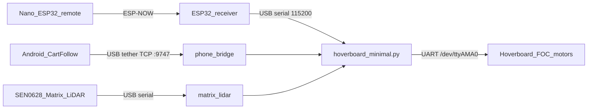

# Electric Golf Push Cart

Motorized 3-wheel golf push cart using hoverboard motors, a Raspberry Pi Zero 2W, an ESP32 handheld remote, and phone-camera follow-me with Matrix LiDAR distance.

## Architecture



| Path | Role |
|------|------|
| Remote → ESP-NOW → receiver → USB | Joystick drive, cruise, mode selects, summon / e-stop |
| Phone → TCP `:9747` | Follow-me **steering** (pose tracking) |
| Matrix LiDAR on Pi | Follow-me **throttle** (target ~200 cm); phone body-size is backup |
| Pi → hoverboard UART | Differential steer/speed commands |

Phone follow details: [android/CartFollow/README.md](android/CartFollow/README.md).

## Repo map

| Path | Purpose |
|------|---------|
| [`hoverboard_minimal.py`](hoverboard_minimal.py) | Main Pi controller |
| [`phone_bridge.py`](phone_bridge.py) | TCP listener for Cart Follow packets |
| [`matrix_lidar.py`](matrix_lidar.py) | DFRobot SEN0628 distance → throttle |
| [`cart_protocol.py`](cart_protocol.py) | Shared `0xAA`…`0xBB` packet framing |
| [`phone_gps.py`](phone_gps.py) | Optional GPS helpers (summon logging) |
| [`golf_green_yardages.py`](golf_green_yardages.py) | Course green yardage POC |
| [`minimal_controller.ino`](minimal_controller.ino) | Handheld Nano ESP32 firmware (current) |
| [`receiver_minimal/`](receiver_minimal/) | Cart-side ESP32 ESP-NOW → USB bridge |
| [`android/CartFollow/`](android/CartFollow/) | Pose-tracking follow app |
| [`hoverboard-controller.service`](hoverboard-controller.service) | systemd unit for boot |
| [`GOLF_STATS.md`](GOLF_STATS.md) | Round-stats feature spec |
| `controller/`, `controller_nano/` | Older remote firmwares (legacy) |

## Hardware

- **Pi Zero 2W** — runs `hoverboard_minimal.py`
- **2× hoverboard motors** — EFeru FOC firmware ([hoverboard-firmware-hack-FOC](https://github.com/EFeru/hoverboard-firmware-hack-FOC)), UART at **115200** on `/dev/ttyAMA0`
- **Arduino Nano ESP32** — handheld remote (joystick + buttons + OLED)
- **ESP32 receiver** — USB to Pi, ESP-NOW from remote
- **Phone** — Cart Follow app over USB tethering
- **DFRobot SEN0628 Matrix LiDAR** — USB-C into the Pi hub (8×8 text stream @ 115200); optional I2C via `MATRIX_LIDAR_MODE=i2c`
- **MPU6050 on Pi (I2C)** — tilt cutout (~5°)
- **Power** — 36 V motors; 5 V for Pi / ESP32s / logic

Typical Pi USB hub: ESP32 receiver + LiDAR (+ optional phone tether / GPS).

Remote pins (Nano ESP32, from `minimal_controller.ino`): joystick X=`A1`, Y=`A0`, stick button=`D2`; Buttons 1–4 on `D3`–`D6`; SSD1306 on GPIO 8/9; remote MPU on GPIO 10/11.

## Quick start

### 1. Flash motor + ESP32 firmware

1. Flash both hoverboard boards with EFeru FOC firmware.
2. Upload [`minimal_controller.ino`](minimal_controller.ino) to the handheld Nano ESP32.
3. Upload [`receiver_minimal/receiver_minimal.ino`](receiver_minimal/receiver_minimal.ino) to the cart receiver ESP32.

### 2. Pi dependencies

```bash
pip install -r requirements.txt
# pyserial, smbus2
```

Optional green-yardage POC:

```bash
pip install -r requirements-golf.txt
```

### 3. Run the controller

```bash
python3 hoverboard_minimal.py          # debug logging (default)
python3 hoverboard_minimal.py --silent # production / systemd
```

Phone bridge (`:9747`) and LiDAR follow start with the controller.

For boot: edit [`hoverboard-controller.service`](hoverboard-controller.service) (`User` / `Group`), copy it to `/etc/systemd/system/`, then `daemon-reload` / `enable --now`. Paths use `%h` (that user's home), so no absolute home path is needed.

### 4. Follow-me (phone + LiDAR)

1. USB-tether the phone to the Pi, enable USB tethering on the phone.
2. Open **Cart Follow**, calibrate, then **Scan & Connect to Pi**.
3. On the remote, cycle Button 1 to **FOLLOW** mode.

Full steps and tuning: [android/CartFollow/README.md](android/CartFollow/README.md).

## Operating modes

### Handheld remote

| Control | Action |
|---------|--------|
| Joystick Y / X | Throttle / steering (tank mix on Pi) |
| Button 1 | Cycle modes: **NORM → TURBO → FOLLOW → PARK** (OLED; turbo boost currently disabled in firmware) |
| Button 2 | Cruise on/off (hold stick F/B to trim speed while cruising) |
| Button 3 (in FOLLOW) | **Double-tap** summon (approach → 180° → pause); **single-tap** resume; **hold ~5 s** recalibrate |
| Joystick click | Emergency stop toggle |

Follow-me only engages when Cart Follow is connected and calibrated; otherwise the Pi stays on joystick control.

### Follow-me motion split

| Input | Source |
|-------|--------|
| Steering | Phone pose tracking |
| Throttle / distance | Matrix LiDAR (primary); phone torso-size estimate if LiDAR has no reading |
| No person | Stop |

### Safety

- Remote e-stop and ESP-NOW / link loss → stop
- MPU6050 tilt threshold on the Pi
- Joystick deadzone and smoothed accel/decel
- Follow-me blocked until phone calibration succeeds

## Golf helpers (optional)

- [`golf_green_yardages.py`](golf_green_yardages.py) + [`golf_courses/`](golf_courses/) — offline green F/M/B yardages POC
- Planned automatic round logging / touchscreen wizard: [GOLF_STATS.md](GOLF_STATS.md)

## Roadmap

- Terrain-aware stop / curb crawl / soft-terrain pass-through (LiDAR grid + camera)
- Rope / fence detection (~0.5 m scan plane)
- Cart-path-only geofencing from course maps
- Golf stats phases in [GOLF_STATS.md](GOLF_STATS.md) (GPS on summon, hole wizard, home sync)

## Safety

High-voltage motors and a moving cart. Test in open space, keep the remote reachable for e-stop, and verify wiring before every outing. Use at your own risk and follow local rules for motorized vehicles on courses / paths.
